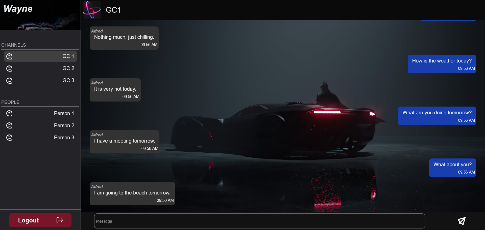

# ChatApp

Simple chatting app using WebSockets, Node.js on backend and Vanilla JS, WebSockets API on frontend.

## Requirements

- Node.Js
  - express
  - nodemon
  - ws

## Quick Start

### Backend

PORT: `5000`

```bash
cd ./Backend
npm i
npm run dev
```

### Frontend

PORT: `3000`

```bash
cd ./Frontend
npm i
npm run dev
```

The Frontend should be running on [http://localhost:3000](http://localhost:3000).

The Backend should be running on [http://localhost:5000](http://localhost:5000). (Not to be accessed via browser)

## Gallery



[ucx15 @ GitHub](https://github.com/ucx15)
